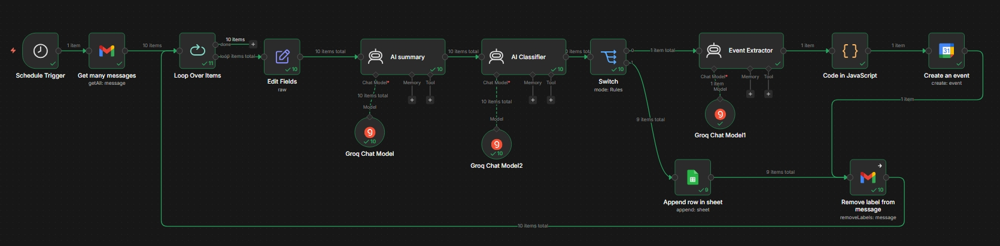
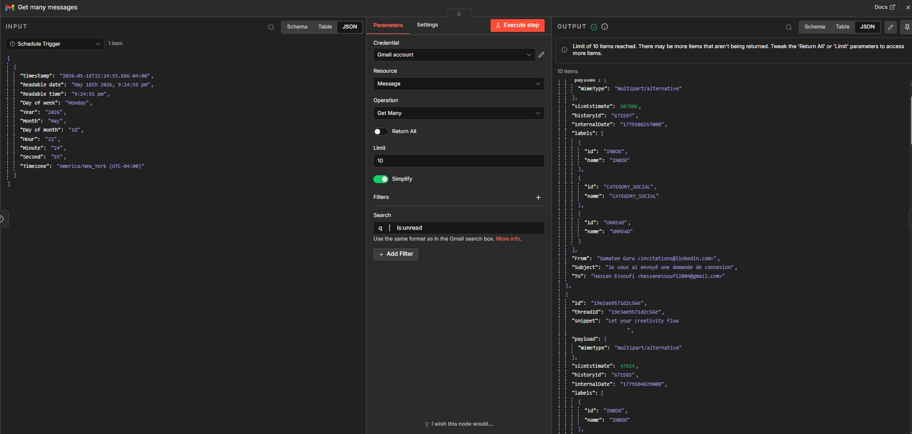
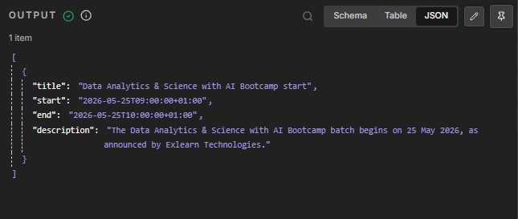
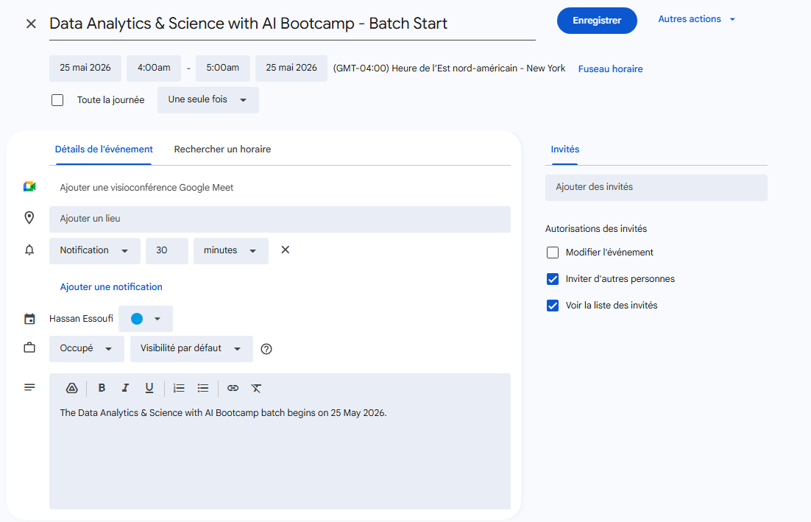
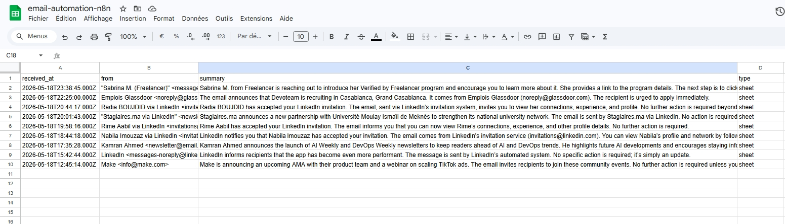

# Email Automation Agent-n8n

An intelligent email automation workflow built with **n8n** that continuously monitors your Gmail inbox, classifies every unread email using an AI model, and automatically routes it to the right destination: calendar events go straight into **Google Calendar**, everything else gets logged and summarized in **Google Sheets**.

---

## Overview

The agent runs on a schedule (every minute by default) and processes up to 10 unread emails per cycle. For each email it:

1. Extracts structured fields from the raw Gmail payload
2. Generates a concise AI summary (Groq LLM)
3. Classifies the email as `event` or `sheet` (Groq LLM)
4. Routes accordingly:
   - **event** → extracts date/time details → creates a Google Calendar event
   - **sheet** → appends a summary row to Google Sheets
5. Marks the email as read so it is never processed twice

---

## Workflow



---

## Features

- **Zero-touch inbox management** — runs automatically on a cron schedule
- **AI-powered classification** — Groq-hosted LLMs decide `event` vs `sheet` with no rules to maintain
- **Automatic calendar entry** — meetings, interviews, bootcamp starts, calls — anything with a date gets added to Google Calendar
- **Email log spreadsheet** — every non-event email is summarised and stored in Google Sheets with sender, timestamp, and AI summary
- **Mark-as-read on completion** — processed emails are never picked up again
- **Batch processing with loop** — handles up to 10 emails per trigger cycle with automatic iteration

---

## How It Looks in Action

### Gmail — Fetching Unread Messages


The node queries Gmail with `is:unread`, retrieves up to 10 messages per run, and passes each one into the processing loop.

### AI Event Extraction Output


When an email is classified as `event`, the Event Extractor AI returns a structured JSON object containing the title, ISO 8601 start/end times (Morocco timezone `+01:00`), and a description ready for the Google Calendar API.

### Google Calendar — Event Created


The extracted event is created directly in Google Calendar. Title, date, time, and description are all sourced from the email content.

### Google Sheets — Email Log


Non-event emails are appended as rows with four columns: `received_at`, `from`, `summary`, and `type`. The AI summary condenses the email to 2–3 sentences so the log stays scannable.

---

## Tech Stack

| Component | Technology |
|---|---|
| Workflow engine | [n8n](https://n8n.io) (self-hosted via Docker) |
| LLM provider | [Groq](https://groq.com) (OpenAI-compatible API) |
| AI models | `openai/gpt-oss-20b` (summary & classifier), `openai/gpt-oss-120b` (event extractor) |
| Email | Gmail (OAuth 2.0) |
| Calendar | Google Calendar (OAuth 2.0) |
| Spreadsheet | Google Sheets (OAuth 2.0) |

---

## Repository Structure

```
email-agent-n8n/
├── workflows/
│   └── email_automation_agent.json   # Importable n8n workflow
├── system_prompts/
│   ├── classifier_prompt.txt          # System prompt for AI Classifier node
│   ├── event_extractor_prompt.txt     # System prompt for Event Extractor node
│   └── summarizer_prompt.txt          # System prompt for AI Summary node
├── examples/
│   ├── sample-email.json              # Example raw Gmail message payload
│   ├── extracte_event.json            # Example event extractor output
│   └── calendar_response.json         # Example Google Calendar API response
├── screenshots/                       # Workflow and output screenshots
├── docs/
│   ├── architecture.md                # Node-by-node architecture breakdown
│   ├── setup_guide.md                 # Step-by-step setup instructions
│   └── workflow_explanation.md        # Detailed workflow logic explanation
└── docker-compose.yml                 # Self-hosted n8n setup
```

---

## Quick Start

### 1. Start n8n with Docker

```bash
docker compose up -d
```

Open `http://localhost:5678` and create your account.

### 2. Connect credentials

Inside n8n, add the following credentials:

- **Gmail OAuth2** — `n8n-nodes-base.gmailOAuth2`
- **Google Calendar OAuth2** — `n8n-nodes-base.googleCalendarOAuth2Api`
- **Google Sheets OAuth2** — `n8n-nodes-base.googleSheetsOAuth2Api`
- **Groq API** — `@n8n/n8n-nodes-langchain.lmChatGroq`

### 3. Import the workflow

Go to **Workflows → Import** and upload `workflows/email_automation_agent.json`.

### 4. Configure your targets

Update two nodes inside the workflow:

- **Append row in sheet** → set your Google Sheets document ID and sheet name
- **Create an event** → set your Google Calendar email/ID

### 5. Activate

Toggle the workflow to **Active**. It will now run every minute automatically.

See [docs/setup_guide.md](docs/setup_guide.md) for detailed instructions.

---

## Documentation

- [Architecture](docs/architecture.md) — how every node fits together
- [Setup Guide](docs/setup_guide.md) — full credential and configuration walkthrough
- [Workflow Explanation](docs/workflow_explanation.md) — deep dive into the processing logic

---

## Author

**Hassan Essoufi**
- GitHub: [@Hassan-essoufi](https://github.com/Hassan-essoufi)
- Email: hassanessoufi2004@gmail.com

---

## ⭐ Note

If you find this project useful, consider giving it a star ⭐, it helps a lot!
